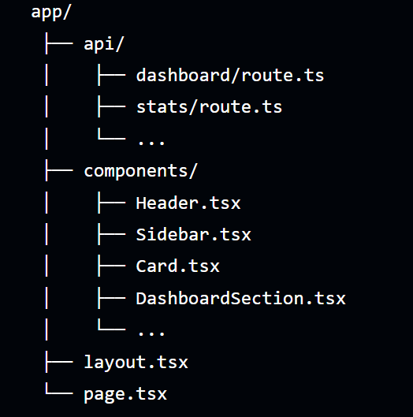

# 🌍 Achilyon Frontend Assessment  
**Next.js + TailwindCSS + Shadcn/UI + TypeScript + Internal API Routes**


---

## 🌟 Overview

This project is my implementation of the **Achilyon Software Frontend Assessment**.  
The goal was to reproduce the provided UI using:

- **Next.js App Router**
- **TailwindCSS**
- **Shadcn/UI**
- **TypeScript**
- **Internal API routes** to power every dynamic section

The entire UI is **data-driven**, consuming JSON from `/api/data`, making the structure clean, scalable, and easy to extend.

---

## 🔗 Live Demo & Repository

| Resource | Link |
|---------|------|
| 🌐 **Live Deployed URL** | _https://your-vercel-url.vercel.app_ |
| 📦 **GitHub Repository** | https://github.com/MansiMore-0817/achilyon_assessment |

---

## 🚀 Tech Stack

### **Frontend**
- Next.js App Router
- React 18
- TailwindCSS
- Shadcn/UI Components
- TypeScript

### **Backend**
- Next.js API Routes
- Static mock JSON data (`/api/data`)

### **Deployment**
- Vercel

---

## 📁 Folder Structure




---

## 🧠 Assumptions

- The original design did not include real images, so **Unsplash placeholders** were used.
- Iconography in the design was proprietary, so I used **custom SVG icons** to replace them.
- I focused on **UI structure, layout fidelity, responsiveness**, and **API-driven components**.
- The layout was broken into clean modular components to match real-world production structure.

---

## 🧩 Data Structure Explanation

The `/api/data` endpoint returns a single JSON object:

```ts
{
  hero: { eyebrow, title, cta },
  promos: [...],
  adventureHighlights: [...],
  destinations: [...],
  features: [...]
}
```


## 📡 API-Driven Architecture

Every dynamic element (cards, metrics, lists, sections) loads from an internal API.

### **Why this approach?**
- Ensures **clean separation** between UI and data  
- Easier to **scale**, modify, or plug to a real backend later  
- Avoids hardcoded values  
- Cleaner, more testable components  

## UI / UX Implementation

Recreated the provided design with attention to spacing, layout, and typography

Uses TailwindCSS for structure + styling

Uses Shadcn/UI for consistent components

Fully responsive for mobile and desktop

Placeholder images used where assets were not provided

## 🌐 Deployment

The project is deployed publicly using Vercel.

API routes work in production

Layout and static assets render correctly

Live Demo: add your Vercel link here
📂 GitHub Repo: https://github.com/MansiMore-0817/achilyon_assessment

## Features Implemented

Fully responsive UI

Clean component structure

API-powered content

Modular and scalable data architecture

Shadcn-based UI components

Deployed on Vercel


## Running locally

```bash
git clone https://github.com/MansiMore-0817/achilyon_assessment

cd achilyon_assessment

npm install

npm run dev

```
## 📬 Connect With Me

[](https://www.linkedin.com/in/mansimore0817)

<p align="center">Built by <b>Mansi More</b> • moremansi1707@gmail.com</p>

